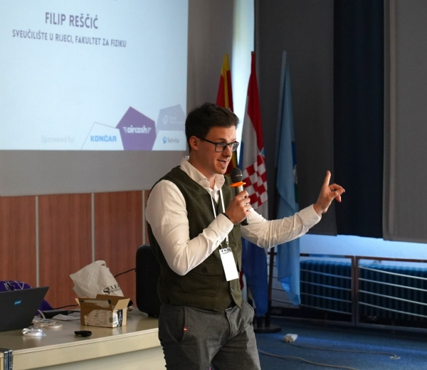

# Welcome!

> "If you work for a living, why do you kill yourself working?"
>
> ~ Tuco (*The Good, the Bad and the Ugly*)

!!! info "Latest updates"
      - Participated and gave a talk at the 1st Annual [BridgeQG Conference](https://indico.in2p3.fr/event/34939/overview).
      - Participated at the Croatian Science Foundation [PhD Café](https://hrzz.hr/odrzan-rijeka-phd-cafe-6/).
      - *The Southern Wide-field Gamma-ray Observatory* (SWGO) White Paper now available on [ArXiv](https://arxiv.org/abs/2506.01786).  
      - Presented the research group [Wrinkle](https://wrinkle.uniri.hr/) on the [BridgeQG](https://www.cost.eu/actions/CA23130/) COST Action WG2 meeting. You can find the presentation [here](files/bridgeqg_wrinkle.pdf).  
      - New preprint available on [ArXiv](https://arxiv.org/abs/2503.15203).  
      - Participated at the school "Searching for Quantum Gravity in the Sky" [:link:](https://www.dpg-physik.de/veranstaltungen/2025/searching_for_quantum_gravity_in_the_sky)
      - Erasmus+ Mobility at the Facultad de Ciencias, Universidad de Zaragoza. Period: 13. 1. 2025. - 12. 2. 2025.
      - COST Action CA18108 "*White Paper and Roadmap for Quantum Gravity Phenomenology in the Multi-Messenger Era*" published in *Classical and Quantum Gravity*. You can find it [here](https://doi.org/10.1088/1361-6382/ad605a).

    ??? info "2024"
        - Research visit at the Department of Physics and Astronomy "Galileo Galilei" of the University of Padova. The stay was funded by the Croatian Science Foundation Oubound Mobility grant MOBDOK-2023. Period: 16. 9. 2024. - 31. 12. 2024.
        - Published research paper in *Physical Review D* titled "*Approaches to photon absorption in a Lorentz inavariance violation scenario*". You can find it [here](https://doi.org/10.1103/PhysRevD.110.063035).
        - Erasmus+ Mobility at the Facultad de Ciencias, Universidad de Zaragoza. Period: 2. 9. 2024. - 15. 9. 2024.
        - Participated at the "*Fifth annual conference on quantum gravity phenomenology in the multi-messenger era (QGMM24)*" in Madrid, Spain.
        - Participated at the "*MPIK-CDY School on the Future of Gamma-Ray Astronomy*" [:link:](https://www.mpi-hd.mpg.de/MPIK_CDY_2024/) 
        - Defended the Research Area "*Investigating Quantum Gravity's Influence on the Universe Transparency*".
        - Completed the course "*Selected chapters in astrophysics*".
        - Delivered talk on "*Approaches to Universe transparency study in an LIV scenario*" for the Seminar in Physics course.
        - Erasmus+ Mobility at the Facultad de Ciencias, Universidad de Zaragoza. Period: 8. 1. 2024. - 6. 2. 2024.

- <figure markdown="" style="float: center;">
  
    <figcaption style="font-size: 0.7em; font-style: italic; text-align: center;">
    <!-- <a href="https://udruga-penkala.hr/mutimir-2024/">Mutimir</a> conference, Association <a href="https://udruga-penkala.hr/en/association-penkala-2/">Penkala</a>, 2024. -->
  </figcaption> 
</figure>

-   :material-account-circle:{ .lg .middle } __General info__

    ---
    - Teaching assistant and PhD student at the [Faculty of Physics](https://www.arhiva.phy.uniri.hr/en/), [University of Rijeka](https://uniri.hr/en/home/) :hr:
    - PhD student at the [Faculty of Science](https://ciencias.unizar.es/intymov-incoming-students), [University of Zaragoza](https://www.unizar.es/) :es:
    - Master of Science (2022) [Faculty of Physics](https://www.physik.lmu.de/en/), [Ludwig Maximilian University of Munich](https://www.lmu.de/en/) :de:
  
    <!-- Feel free to explore my [publications](papers.md), ongoing [projects](projects.md) and [scientific activities](science.md). -->

-   :material-contacts:{ .lg .middle } __Contact__

    ---

    [Faculty of Physics](https://www.arhiva.phy.uniri.hr/en/), [Univesity of Rijeka](https://uniri.hr/en/home/)

    Radmile Matejčić 2, 51000 Rijeka, Croatia

    Office O-S10

    phone: +385 (0)51 584 629

    e-mail: [filip.rescic [at] uniri.hr](mailto:filip.rescic@uniri.hr)

-   :material-telescope:{ .lg .middle } __Research Interests__

    ---

    - Gamma-ray Astrophysics
    - Quantum Gravity Phenomenology
    - Lorentz Invariance Violation
    - Doubly Special Relativity

-   :material-account-group:{ .lg .middle } __Memberships__

    ---

    - Collaborations: [SWGO](https://www.swgo.org/SWGOWiki/doku.php), [BridgeQG](https://web.infn.it/BridgeQG/)
    - Research groups: [Wrinkle](https://wrinkle.uniri.hr/), [QuGraPheno](https://qugraphenozaragoza.wordpress.com/)
    - Institutes: [CAPA](https://capa.unizar.es/)
    - Other: [DMF](http://dmf.hr/), [Penkala](https://udruga-penkala.hr/en/association-penkala-2/)

-   :material-account-clock:{ .lg .middle } __Independent Pursuits__

    ---

    - Private tutoring venture "[Didaktra](https://didaktra.com/)"
    - Trading :chart_with_upwards_trend: (check out my [portfolio](portfolio.md))
    - Metaphysic[s](https://www.youtube.com/watch?v=AxkZJmi-5xc)
    - Economics

