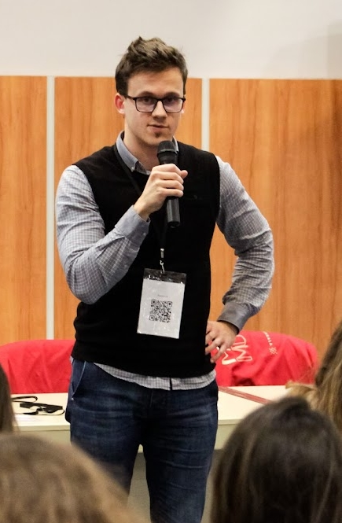

# Welcome!

<!-- ## General info

 {align=right, width="200", height="auto"}
 &nbsp; 

- Teaching assistant and PhD student at the [Faculty of Physics](https://www.phy.uniri.hr/en/), [University of Rijeka](https://uniri.hr/en/home/)
- PhD student at the [Faculty of Science](https://ciencias.unizar.es/intymov-incoming-students), [University of Zaragoza](https://www.unizar.es/information-institution/name-and-address)
- Member of the PR Team at the [Faculty of Physics](https://www.phy.uniri.hr/en/), [University of Rijeka](https://uniri.hr/en/home/)
- Master of Science (2022.). [Faculty of Physics](https://www.physik.lmu.de/en/), [Ludwig Maximilian University of Munich](https://www.lmu.de/en/). -->

Hi! I'm Filip Rescic, a teaching assistant and PhD student at the [Faculty of Physics](https://www.phy.uniri.hr/en/) ([University of Rijeka](https://uniri.hr/en/home/)), and PhD student at the [Faculty of Science](https://ciencias.unizar.es/intymov-incoming-students) ([University of Zaragoza](https://www.unizar.es/information-institution/name-and-address)). Feel free to explore my publications, ongoing projects and teaching material.

<figure markdown="" style="float: right; margin-left: 70px; margin-bottom: 30px;">
  
   <figcaption style="font-size: 0.7em; font-style: italic; text-align: center;">
    <a href="https://udruga-penkala.hr/mutimir-2022/">Mutimir</a> conference, Association <a href="https://udruga-penkala.hr/en/association-penkala-2/">Penkala</a>, 2022.
  </figcaption>
</figure>

## Scientific interests

- Gamma-ray Astrophysics
- Quantum Gravity Phenomenology
- Lorentz Invariance Violation
- Doubly Special Relativity

## Contact

[Faculty of Physics](https://www.phy.uniri.hr/en/), [Univesity of Rijeka](https://uniri.hr/en/home/)

Radmile Matejčić 2, 51000 Rijeka, Croatia

Office O-S10

phone: +385 (0)51 584 629

e-mail: [filip.rescic@uniri.hr](mailto:filip.rescic@uniri.hr)

## Useful links

- [Inspire-HEP](https://inspirehep.net/authors/2698695)
- [ORCID](https://orcid.org/0000-0002-9664-5414)
- [Google Scholar](https://scholar.google.com/citations?user=No6TvC4AAAAJ&hl=hr&oi=ao)
