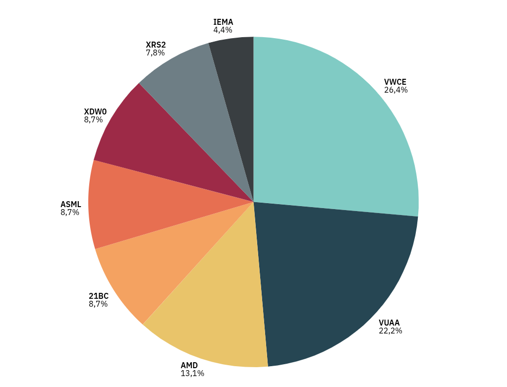

---
hide:
    - navigation
---    

# Portfolio

RoR: **+8%**

For more info regarding past performances, study the tickers using [TradingView](https://www.tradingview.com/)'s [screener](https://www.tradingview.com/screener/).

<!-- <figure markdown="" style="float: center;">
  
    <figcaption style="font-size: 0.7em; font-style: italic; text-align: center;">
    Asset allocation
  </figcaption> -->

  <iframe
    src="https://chart-generator.draxlr.com/embed/mTNBqv8fqGtGCsqzD4aTo7yWPIwAzgcY"
    loading="lazy"
    title="Draxlr pie chart"
    frameborder="0"
    webkitallowfullscreen="true"
    mozallowfullscreen="true"
    style="
      position: absolute;
      top: 0;
      left: 0;
      width: 100%;
      height: 100%;
    "
  ></iframe>

