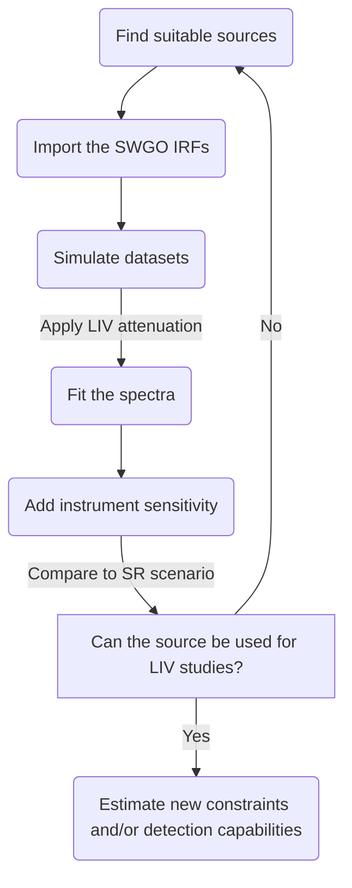

## SWGO sensitivity to LIV

Collaborators: [Michele Doro](https://userswww.pd.infn.it/~mdoro/index.html) (UniPd), Luis Matias Recabarren Vergara (UniPd)

!!! abstract "Summary"
    This research focuses on assessing how the Southern Wide-Field Gamma-ray Observatory (SWGO) could detect effects of Lorentz Invariance Violation (LIV) within the quadratic subluminal scenario in very high and ultra-high energy gamma rays. Intrinsic spectral energy distributions of astrophysical sources are modeled, and then attenuated using both special relativistic and LIV-modified survival probabilities. These two attenuation models are compared with SWGO’s projected sensitivity in the relevant energy ranges to explore SWGO’s potential to identify or limit possible LIV effects.

!!! Success
    Presented our work in the talk "*Assessing SWGO Sensitivity to Lorentz Invariance Violation through Transparency Studies*" at the 1st Annual [BridgeQG Conference](https://indico.in2p3.fr/event/34939/overview)

### Gammapy installation

The analysis is primarily conducted using the Python package [Gammapy](https://docs.gammapy.org/dev/index.html). One of the recommended installation methods is via [Miniconda](https://docs.anaconda.com/miniconda/). To install Miniconda, run the following command(s) in the terminal:

```sh
mkdir -p ~/miniconda3
wget https://repo.anaconda.com/miniconda/Miniconda3-latest-Linux-x86_64.sh -O ~/miniconda3/miniconda.sh
bash ~/miniconda3/miniconda.sh -b -u -p ~/miniconda3
rm ~/miniconda3/miniconda.sh
source ~/miniconda3/bin/activate
conda init --all
```

For more information on installing Miniconda, click [here](https://docs.anaconda.com/miniconda/install/#quick-command-line-install). Once Miniconda is set up, each stable Gammapy release provides a pre-defined conda environment file to simplify installation and include additional useful packages. To set it up, run:  

```sh
curl -O https://gammapy.org/download/install/gammapy-|release|-environment.yml
conda env create -f gammapy-|release|-environment.yml
```

Modify the `|release|` placeholder in the code to match the desired [Gammapy release](https://docs.gammapy.org/dev/release-notes/index.html).

Finally, in [VSCode](https://code.visualstudio.com/), press `Ctrl+Shift+P`, search for `"Python: Select Interpreter"`, and choose Gammapy as the interpreter.  

### Pipeline development



## Theoretical studies of LIV and DSR

Collaborators: [José Manuel Carmona](https://personal.unizar.es/jcarmona/) (UniZar), Jose Luis Cortés (UniZar), Maykoll Reyes (UniZar)

!!! abstract "Summary"
    This project involves theoretical calculations within the framework of the quadratic subluminal scenario of Lorentz Invariance Violation (LIV) and the exploration of phenomenological models in Doubly Special Relativity (DSR). Given that the primary interaction in studies of Universe transparency is electron-positron pair production from photon collisions, this work centers on calculating key observables, including the cross-section of this process and the corresponding opacity function in the different models.

!!! Success
    Published research paper titled "*Approaches to photon absorption in a Lorentz inavariance violation scenario*" in *Physical Review D*. There we present a novel result for the cross section of the $\gamma\gamma\to e^+e^−$ pair-production process in the quadratic subluminal LIV scenario. You can find the paper [here](https://doi.org/10.1103/PhysRevD.110.063035).

### Gamma-ray Attenuation and Opacity  

The observed flux of gamma rays on Earth, $\frac{d\Phi}{dE}$, is related to the intrinsic flux at the source, $\frac{dN_{\text{int}}}{dE_e}$, through the attenuation factor $\text{P}_{\gamma\gamma}$  

$$
\frac{dN}{dE} = \frac{dN_{\text{int}}}{dE_e} \times \text{P}_{\gamma\gamma}(E, z_s)\,,  
$$

where $E_e = E(1+z_s)$ is the emitted gamma-ray energy at redshift $z_s$.  

The attenuation factor $\text{P}_{\gamma\gamma}(E, z_s)$ quantifies the suppression of the gamma-ray flux due to interactions with the background photon fields. It is related to the optical depth $\tau(E, z_s)$ by  

$$
\text{P}_{\gamma\gamma}(E, z_s) = \exp(-\tau(E, z_s))\,.  
$$

The opacity $\tau(E, z_s)$ encapsulates the probability of gamma-ray absorption along its path to Earth and is computed by integrating over the relevant physical parameters:  

$$
\tau(E,z_s) = \int_{0}^{z_s} dz \, \frac{dl}{dz} \int_{-1}^{1} d\cos\theta \left(\frac{1-\cos\theta}{2}\right) \times \int_{\varepsilon_\text{thr}(E,\theta)}^\infty d\varepsilon \; n(\varepsilon,z) \,\sigma(E(1+z),\varepsilon,\theta) \,.
$$

Here, $\varepsilon_{\text{thr}}(E, \theta)$ is the minimum background photon energy required to satisfy the threshold condition. The function $n(\varepsilon, z)$ represents the spectral density of the background photons, while $\sigma(E(1+z), \varepsilon, \theta)$ is the pair-production cross-section. The term $dl/dz$ describes the cosmological scaling of the photon’s propagation path and, within the \( \Lambda \)CDM model, is given by

$$
\frac{dl}{dz} = \frac{1}{(1+z)H_0\sqrt{\Omega_m(1+z)^3+\Omega_\Lambda}}\,,  
$$

where $H_0$ is the present value of the Hubble constant, and $\Omega_m$ and $\Omega_\Lambda$ are the matter and cosmological constant relative densities, respectively.
This framework allows for the study of gamma-ray attenuation in both standard SR and scenarios that go beyond such as LIV or DSR, where modifications to the dispersion relation affect the cross-section and thus the overall opacity function.
